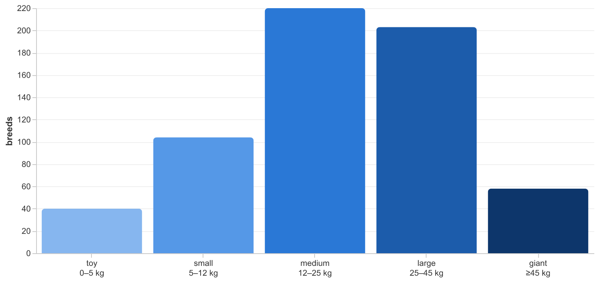
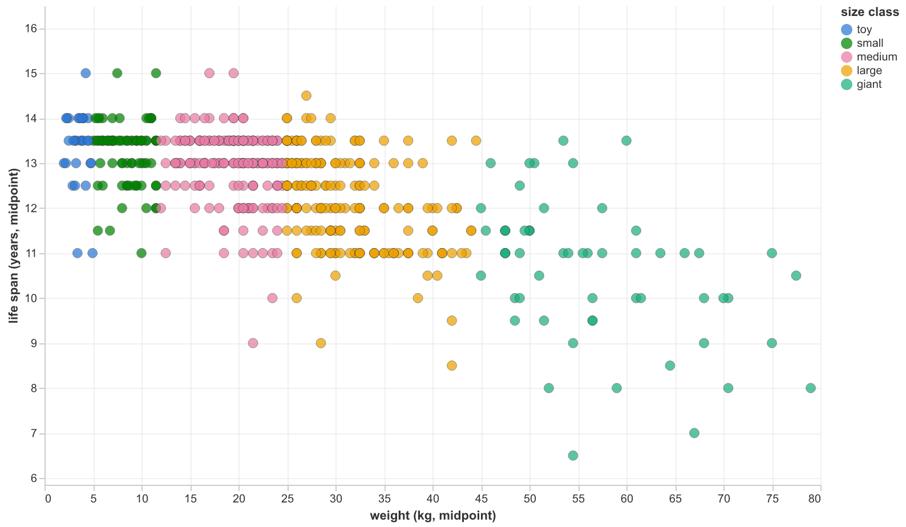
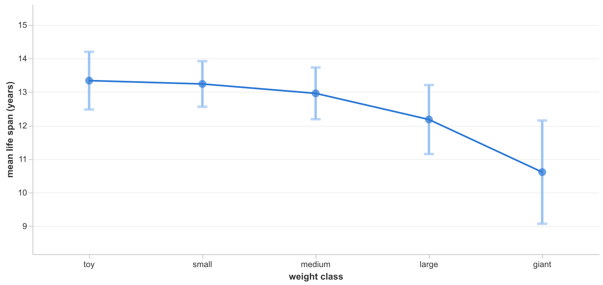
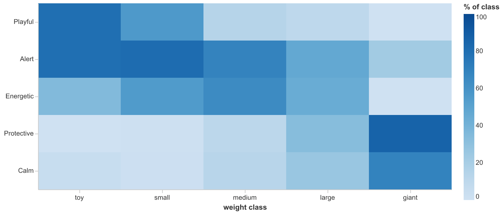

# Dashboard → gold: data lineage

*Companion to the [dashboard narrative](../README.md#the-dashboard--what-the-data-says). That page says
**what the data says**; this one says **where every number comes from**.*

The dashboard is **thin by contract**: it computes no facts. [`dashboard/app.py`](../dashboard/app.py)
issues **exactly five `SELECT`s — one per gold mart — and reads two seed CSVs directly. Nothing else.**
Every number shown is read from a gold table that was **computed, tested, and frozen at pipeline
time** — never recomputed in the app.

## The whole surface — everything the app reads

Each mart is read as `select * from main_marts.<mart>` (`temp` selects its six columns by name). The
two seeds are read as **CSV files, not tables** ([app.py:77](../dashboard/app.py#L77)) — the same file
dbt loads, so they can't drift, but the app runs without a prod re-seed.

| app var | gold mart / source | grain |
|---|---|---|
| `cov` | `mart_data_coverage` | 1 row |
| `summary` | `mart_size_class_summary` | 6 · per `size_class` |
| `corr` | `mart_metric_correlation` | 3 · metric pairs |
| `svl` | `mart_size_vs_lifespan` | 627 per breed (app filters to 585) |
| `temp` | `mart_size_class_temperaments` | per (class, tag) |
| `BANDS` | `seeds/size_class_bands.csv` | 5 · seed CSV |
| `tags` | `seeds/dashboard_temperament_tags.csv` | 5 · seed CSV |

## The four charts — each wired to its mart



**Distribution bars** ← `mart_size_class_summary` (`size_class`, `breed_count`) **+** `size_class_bands`
seed (the kg ranges printed under each tick).

---



**Weight-vs-life-span scatter** ← `mart_size_vs_lifespan` (`weight_mid_kg`, `life_span_mid_years`,
`size_class` = colour, `breed_name` = tooltip). The 585-of-627 subset is the app's `where … is not null`.

---



**Mean life span ±1σ** ← `mart_size_class_summary`: the line is `mean_life_span_years`, the bars are
`stddev_life_span_years` drawn as mean ± σ — **chart geometry off two columns, not a new statistic.**

---



**Temperament heatmap** ← `mart_size_class_temperaments` (`size_class`, `temperament_display` = row
label, `pct_of_class` = colour) **+** `dashboard_temperament_tags` seed (which 5 tags, in what order).

## The other dashboard elements (no chart)

Same rule — every number read from a mart:

| element | reads | columns |
|---|---|---|
| Header coverage strip | `mart_data_coverage` | `total_breeds`, `breeds_with_weight`, `breeds_with_life_span`, `breeds_with_temperament` |
| Longest-lived table | `mart_size_vs_lifespan` | `breed_name`, `size_class`, `weight_mid_kg`, `life_span_mid_years` (sort), `life_span_min/max_years` (published range) |
| "Why weight, not height" table | `mart_metric_correlation` | `metric_a`, `metric_b`, `correlation`, `n_breeds` |
| Footer coverage table | `mart_data_coverage` | all 7 columns + `corr.n_breeds` (the with-both = plotted = *n* cross-check) |

## Where the marts come from (the upstream half)

Three marts read `dim_breeds` only; two also read the `breed_temperaments` bridge. It all narrows to
`dim_breeds`:

```
Dog API --ingest.py--> raw.breeds --stg_breeds--+--> dim_breeds --+--> mart_size_class_summary
              (source)    (+ size_class_bands seed)               +--> mart_size_vs_lifespan
                                                                  +--> mart_metric_correlation
                       stg_breed_temperaments                     +--> mart_data_coverage        <-+
                              +--> breed_temperaments (bridge) ---+--> mart_size_class_temperaments |
                                                                      (bridge) --------------------+
```

Every gold column the dashboard shows is either a `dim_breeds` field or an aggregate of one (`count`,
`avg`, `stddev_samp`, `corr`).

## One number's full journey

The "why weight, not height" caption — **weight ↔ life span −0.67**:

```
Dog API   "weight": {"metric": "3 - 6"} ,  "life_span": "12 - 15 years"
  ingest.py   -> raw.breeds       (untouched payload + run_date, loaded_at)
  stg_breeds  -> parse "3-6" -> min/max, cast, dedupe, keep latest run_date
  dim_breeds  -> weight_mid_kg = (min+max)/2 ; life_span_mid_years   (business logic)
  mart_metric_correlation -> round(corr(weight_mid_kg, life_span_mid_years), 3) = -0.670, n=585
  app.py      -> rho("weight_mid_kg", "life_span_mid_years")  reads that one cell
  -> caption: "weight predicts life span more strongly (-0.67 vs -0.50)"
```

The coefficient is **computed once, in gold**. The app only selects the cell.

## The thin-dashboard proof

Everything the app does is **read, filter, sort, or chart-geometry** — never a computed fact:

- `svl` filters nulls in the `where` (selecting rows already in the mart);
- `temp` filters to the seed tags and reindexes onto a 5×5 grid (a 0-from-absence, not a computed 0);
- the ±1σ bars are `mean ± stddev` off two mart columns.

No `corr`, no `pd.cut`, no percentage, no parse runs in `app.py`. **Every fact crosses the boundary
already computed** — which is exactly what "business logic in gold, dashboard thin" means, made
checkable pixel by pixel.
